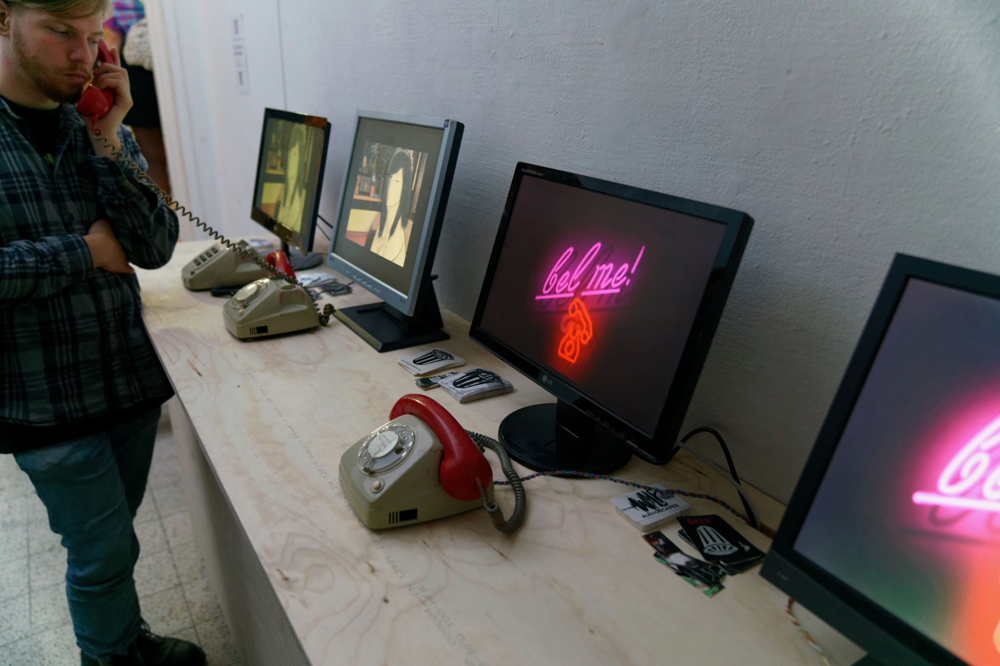

## Saxophone

Art project installation for a friend. Basic idea was to build 4 telephone booths showing "Sex on the telephone" theme animations.
Person in the booth can listen to the audio through the phone.

Depending on the number of phones being used the animations would update on all the screens.



## Tech setup

- each phone has a raspberry pi with a client app running on it
- each raspberry pi audio out is connected to the phone speaker (some simple soldering)
- each raspberry pi is also connected to phone's handset, so when its picked up pi is triggered
- animations are played on pi using  [omxplayer](http://www.raspberry-projects.com/pi/software_utilities/media-players/omxplayer)
- there is also a raspberry pi server which makes sure that all raspberry pi clients are in sync and show the same animation

## Server
```console 
node server

-v              play video
```
    
## Client
```console    
node client

--host          e.g.  192.168.1.68, defaults to localhost
-t              start client in a test mode(listens to keyboard events instead of a phone button)
```

## OMX

kill all:
```console
sudo killall -9 omxplayer.bin
```


play:
```console
omxplayer saxophone/videos/noise.mov --loop --layer 1   --no-osd
omxplayer wombat.h264 --loop --layer 2  --no-osd
```


## RPIO

pins 11 and 17 are used

## Start client/server on boot

```console
sudo su
echo "sudo -u pi /usr/bin/pm2 start /home/pi/saxophone/pm2/client.json" >> /etc/rc.local
echo "sudo -u pi /usr/bin/pm2 start /home/pi/saxophone/pm2/server.json" >> /etc/rc.local
```

## Video

```console
ffmpeg -i input.mp4 -vf scale=1280:720 output.mp4
```  
